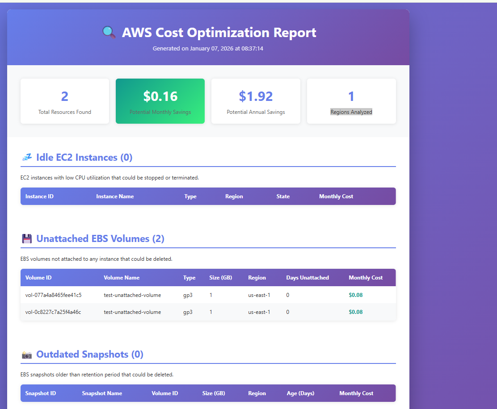
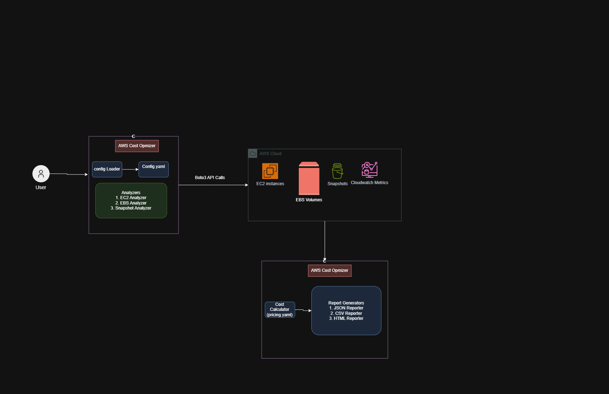
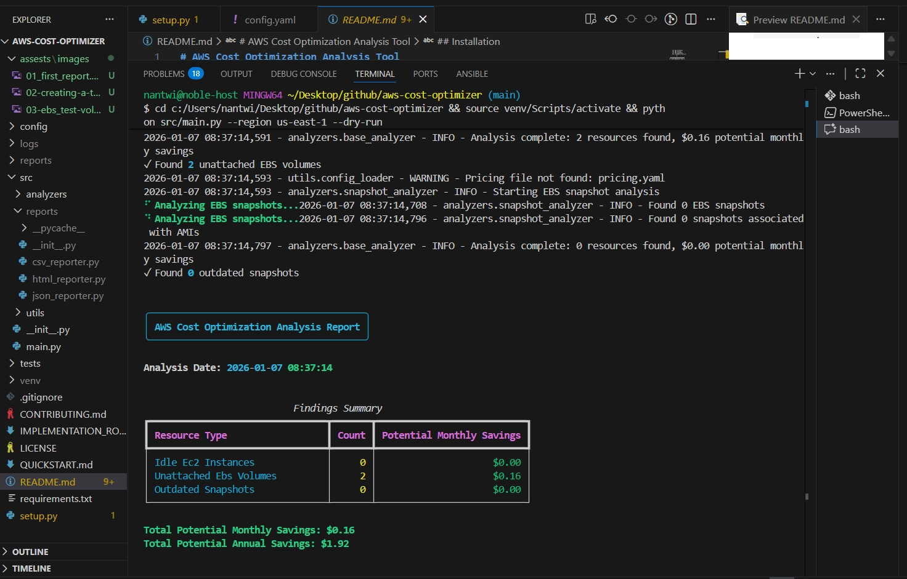
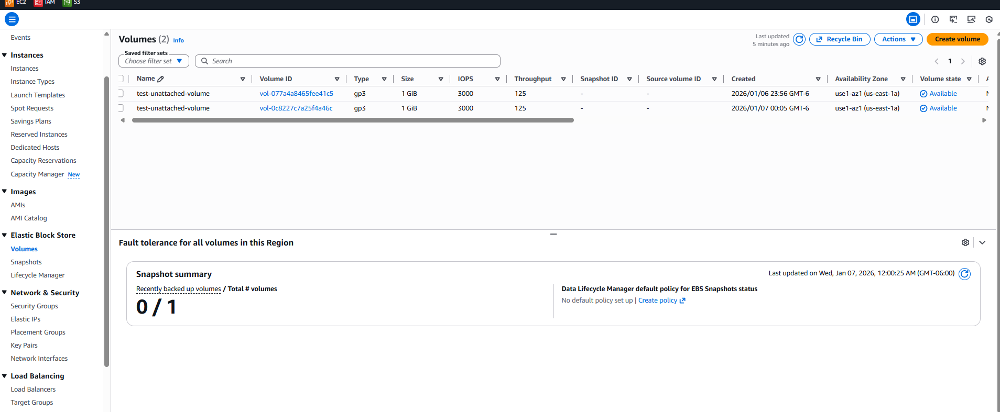

# AWS Cost Optimization Tool

[](https://www.python.org/) [](https://boto3.amazonaws.com/) [](LICENSE)

A comprehensive Python-based CLI tool that analyzes AWS resources across multiple regions and identifies cost optimization opportunities by detecting **idle EC2 instances**, **unattached EBS volumes**, **outdated snapshots**, **unused Elastic IPs**, and **idle RDS databases**. Generates detailed reports in JSON, CSV, and HTML formats with actionable insights.



---

## Features

✨ **Multi-Resource Analysis** - Scans EC2, EBS, Snapshots, Elastic IPs, and RDS  
📊 **Three Report Formats** - JSON (automation), CSV (spreadsheets), HTML (visual)  
🌍 **Multi-Region Support** - Analyze all AWS regions or specific ones  
📈 **CloudWatch Integration** - Real CPU/connection metrics for accurate detection  
💰 **Cost Estimation** - Calculates potential monthly and annual savings  
🎯 **Configurable Thresholds** - Customize detection sensitivity per resource type  
🚀 **Fast & Efficient** - Parallel analysis with progress indicators

---

## What This Tool Does

| Resource | Detection Criteria | Metrics | Potential Savings |
|----------|-------------------|---------|-------------------|
| **EC2 Instances** | CPU utilization < 5% over 7 days | Average CPU % | Stop or rightsize |
| **EBS Volumes** | Unattached for configurable days | Size, Age | Delete unused volumes |
| **Snapshots** | Older than retention period (default: 90 days) | Age, Size | Remove outdated backups |
| **Elastic IPs** | Not associated with any resource | Address, Region | Release unused IPs (~$3.60/month each) |
| **RDS Instances** | CPU < 5% and < 1 connection over 7 days | CPU %, Connections | Stop or downsize |

---

## Architecture



---

## Quick Start

### Prerequisites
- Python 3.8+
- AWS CLI configured with credentials
- IAM permissions for EC2, EBS, RDS, CloudWatch (see [IAM Policy](#-iam-permissions))

### Installation

```bash
# Clone the repository
git clone https://github.com/noble-antwi/aws-cost-optimizer.git
cd aws-cost-optimizer

# Create virtual environment
python -m venv venv
source venv/bin/activate  # Windows: venv\Scripts\activate

# Install dependencies
pip install -r requirements.txt

# Copy configuration
cp config/config.example.yaml config/config.yaml
```

### Run Analysis

```bash
# Analyze all regions
python src/main.py

# Analyze specific region
python src/main.py --region us-east-1

# Analyze specific resource type
python src/main.py --resource-type ec2

# Use specific AWS profile
python src/main.py --profile production
```

### Generate Reports

Reports are automatically generated in `reports/cost-optimization-YYYY-MM-DD_HH-MM-SS/`:
- `cost-optimization-report.html` - Interactive HTML dashboard
- `cost-optimization-report.json` - Complete JSON export
- `cost-optimization-summary.csv` - Executive summary
- `idle-ec2-instances.csv` - EC2 instances with CPU metrics
- `unattached-ebs-volumes.csv` - Unattached EBS volumes
- `outdated-snapshots.csv` - Old snapshots
- `unused-elastic-ips.csv` - Unassociated Elastic IPs
- `idle-rds-instances.csv` - Idle RDS databases

---

## Sample Output

### Terminal Output
When the tool runs, it displays a rich terminal interface showing progress and findings:



### Detection Example
The tool found **2 unattached EBS volumes** in my AWS account:



### HTML Report
Interactive HTML reports are generated with detailed findings and cost estimates:


---

## Configuration

Edit `config/config.yaml` to customize detection thresholds:

```yaml
# EC2 Analysis
ec2:
  cpu_threshold: 5.0              # CPU % below this = idle
  analysis_period_days: 7         # Days to analyze (5 min for testing)
  minimum_uptime_hours: 24        # Ignore recently launched
  check_detailed_monitoring: true # Use CloudWatch detailed metrics

# EBS Analysis  
ebs:
  unattached_days_threshold: 7    # Days unattached before flagging
  check_encryption: true          # Flag unencrypted volumes

# Snapshot Analysis
snapshots:
  retention_days: 90              # Snapshots older than this flagged
  check_ami_association: true     # Skip snapshots used by AMIs

# Elastic IP Analysis
elastic_ip:
  include_associated_eips: false  # Only show unassociated

# RDS Analysis
rds:
  cpu_threshold: 5.0              # CPU % below this = idle
  max_connections: 1              # Max connections allowed
  analysis_period_days: 7         # Days to analyze (5 min for testing)

# Regions to analyze
regions:
  - us-east-1
  - us-west-2
  # Add more regions or use empty list for all regions
```

---

## Report Formats

All reports are generated automatically and saved in timestamped directories:

### JSON Report
- **File**: `cost-optimization-report.json`
- **Use**: Automation, integration with other tools, CI/CD pipelines
- **Features**: Complete data with all metrics (CPU, connections, etc.)

### CSV Reports  
- **Files**: Individual CSVs per resource type + summary
- **Use**: Excel analysis, data processing, filtering
- **Features**: Includes all metrics like Average CPU %, sizes, costs

### HTML Report
- **File**: `cost-optimization-report.html`
- **Use**: Executive summaries, sharing findings, visual dashboard
- **Features**: Interactive tables, cost calculations, professional styling

**Example Report Location**: `reports/cost-optimization-2026-01-07_20-42-25/`

---

## Architecture


---

## IAM Permissions

Create an IAM policy with these permissions:

```json
{
  "Version": "2012-10-17",
  "Statement": [
    {
      "Effect": "Allow",
      "Action": [
        "ec2:DescribeInstances",
        "ec2:DescribeVolumes",
        "ec2:DescribeSnapshots",
        "ec2:DescribeRegions",
        "ec2:DescribeAddresses",
        "rds:DescribeDBInstances",
        "cloudwatch:GetMetricStatistics"
      ],
      "Resource": "*"
    }
  ]
}
```

---

## CLI Options

```bash
python src/main.py [OPTIONS]

Options:
  --region TEXT              Specific AWS region to analyze (e.g., us-east-1)
  --profile TEXT             AWS profile name (default: default)
  --resource-type TEXT       Filter by resource type: ec2, ebs, snapshots, eip, rds
  --output-format TEXT       Report format: json, csv, html (default: all three)
  --dry-run / --no-dry-run   Preview mode (default: dry-run enabled)
  --config TEXT              Path to config file (default: config/config.yaml)
  --help                     Show detailed help message
```

### Examples

```bash
# Analyze all configured regions for all resource types
python src/main.py

# Analyze only idle EC2 instances in us-east-1
python src/main.py --region us-east-1 --resource-type ec2

# Generate JSON report only with production AWS profile
python src/main.py --profile production --output-format json

# Dry-run analysis (preview without generating reports)
python src/main.py --dry-run
```

---

## Infrastructure as Code (Testing)

A Terraform configuration is included to deploy test resources for validation:

```bash
cd terraform

# Initialize Terraform
terraform init

# Review planned resources
terraform plan

# Deploy test infrastructure (creates EC2, EBS, RDS, Elastic IPs)
terraform apply

# Run cost optimizer against test resources
cd .. && python src/main.py

# Cleanup when done
cd terraform && terraform destroy
```

See [terraform/README.md](terraform/README.md) for detailed setup instructions.

---

## Roadmap

- [x] EC2 idle instance detection with CPU metrics
- [x] Unattached EBS volume analysis
- [x] Outdated snapshot identification
- [x] Elastic IP (unused/unassociated) detection
- [x] RDS idle database detection with connection metrics
- [x] Multi-region support
- [x] HTML/JSON/CSV reports with consistent metrics
- [x] CloudWatch integration for accurate metrics
- [x] Terraform test infrastructure
- [ ] Slack/Email notifications
- [ ] Lambda function deployment
- [ ] Automated remediation actions
- [ ] Cost trend analysis and forecasting
- [ ] Database query performance analysis
- [ ] Reserved Instance (RI) recommendations

---

## Contributing

Contributions are welcome! Please see [CONTRIBUTING.md](CONTRIBUTING.md) for guidelines.

---

## License

This project is licensed under the MIT License - see the [LICENSE](LICENSE) file for details.

---

## Author

**Noble Antwi**

---

## Disclaimer

This tool provides cost optimization **recommendations only**. Always review findings before making infrastructure changes. Cost estimates are approximate and may differ from actual AWS billing.
